# Class Diagram — Архітектура системи (GoF патерни + SOLID)

```mermaid
classDiagram
    %% ─────────────── STRATEGY PATTERN ───────────────
    class IQueueStrategy {
        <<interface>>
        +sort(tickets List~Ticket~) List~Ticket~
        +get_name() str
    }
    class FifoStrategy {
        +sort(tickets) List~Ticket~
        +get_name() str
    }
    class PriorityStrategy {
        +sort(tickets) List~Ticket~
        +get_name() str
    }
    class ShortestJobFirstStrategy {
        +sort(tickets) List~Ticket~
        +get_name() str
    }
    IQueueStrategy <|.. FifoStrategy
    IQueueStrategy <|.. PriorityStrategy
    IQueueStrategy <|.. ShortestJobFirstStrategy

    %% ─────────────── OBSERVER PATTERN ───────────────
    class IQueueObserver {
        <<interface>>
        +on_ticket_created(ticket)
        +on_ticket_called(ticket, window_name)
        +on_ticket_completed(ticket)
        +on_ticket_cancelled(ticket)
        +on_ticket_missed(ticket)
    }
    class NotificationObserver {
        -_repo INotificationRepository
        +on_ticket_created(ticket)
        +on_ticket_called(ticket, window_name)
        +on_ticket_completed(ticket)
        +on_ticket_cancelled(ticket)
        +on_ticket_missed(ticket)
    }
    class LoggingObserver {
        -_events List~dict~
        +on_ticket_created(ticket)
        +on_ticket_called(ticket, window_name)
        +on_ticket_completed(ticket)
        +on_ticket_cancelled(ticket)
        +on_ticket_missed(ticket)
        +get_events() List~dict~
    }
    IQueueObserver <|.. NotificationObserver
    IQueueObserver <|.. LoggingObserver

    %% ─────────────── REPOSITORIES (DIP) ───────────────
    class ITicketRepository {
        <<interface>>
        +save(ticket) Ticket
        +find_by_id(id) Ticket
        +find_all() List~Ticket~
        +find_by_status(status) List~Ticket~
        +find_by_service_type(type) List~Ticket~
        +delete(id) bool
        +count_waiting(service_type) int
    }
    class IWindowRepository {
        <<interface>>
        +save(window) ServiceWindow
        +find_by_id(id) ServiceWindow
        +find_all() List~ServiceWindow~
        +find_available_for_service(type) List~ServiceWindow~
        +delete(id) bool
    }
    class IServiceTypeRepository {
        <<interface>>
        +save(service_type) ServiceType
        +find_by_id(id) ServiceType
        +find_all() List~ServiceType~
        +find_active() List~ServiceType~
        +delete(id) bool
    }
    class INotificationRepository {
        <<interface>>
        +save(notification) Notification
        +find_by_ticket_id(id) List~Notification~
        +find_unsent() List~Notification~
        +find_all() List~Notification~
        +mark_sent(id) bool
    }
    class InMemoryTicketRepository {
        -_store Dict~str,Ticket~
        +save(ticket) Ticket
        +find_by_id(id) Ticket
        +find_all() List~Ticket~
        +find_by_status(status) List~Ticket~
        +find_by_service_type(type) List~Ticket~
        +delete(id) bool
        +count_waiting(service_type) int
        +clear()
    }
    class InMemoryWindowRepository {
        -_store Dict~str,ServiceWindow~
        +save(window) ServiceWindow
        +find_by_id(id) ServiceWindow
        +find_all() List~ServiceWindow~
        +find_available_for_service(type) List~ServiceWindow~
        +delete(id) bool
        +clear()
    }
    class InMemoryServiceTypeRepository {
        -_store Dict~str,ServiceType~
        +save(st) ServiceType
        +find_by_id(id) ServiceType
        +find_all() List~ServiceType~
        +find_active() List~ServiceType~
        +delete(id) bool
        +clear()
    }
    class InMemoryNotificationRepository {
        -_store Dict~str,Notification~
        +save(n) Notification
        +find_by_ticket_id(id) List~Notification~
        +find_unsent() List~Notification~
        +find_all() List~Notification~
        +mark_sent(id) bool
        +clear()
    }
    ITicketRepository <|.. InMemoryTicketRepository
    IWindowRepository <|.. InMemoryWindowRepository
    IServiceTypeRepository <|.. InMemoryServiceTypeRepository
    INotificationRepository <|.. InMemoryNotificationRepository

    %% ─────────────── SERVICES ───────────────
    class QueueService {
        -_ticket_repo ITicketRepository
        -_service_type_repo IServiceTypeRepository
        -_strategy IQueueStrategy
        -_observers List~IQueueObserver~
        -_counters dict
        +add_observer(observer)
        +set_strategy(strategy)
        +get_strategy_name() str
        +issue_ticket(service_type, ...) Ticket
        +get_queue(service_type) List~Ticket~
        +call_next(service_type, window_id, window_name) Ticket
        +call_specific(ticket_id, window_id, window_name) Ticket
        +complete_ticket(ticket_id) Ticket
        +cancel_ticket(ticket_id) Ticket
        +mark_missed(ticket_id) Ticket
        +get_queue_stats() dict
        +get_position(ticket_id) Tuple~int,int~
    }
    class WindowService {
        -_window_repo IWindowRepository
        +create_window(name, service_types, operator) ServiceWindow
        +open_window(window_id) ServiceWindow
        +close_window(window_id) ServiceWindow
        +get_all_windows() List~ServiceWindow~
    }
    class ServiceTypeService {
        -_service_type_repo IServiceTypeRepository
        +create_service(name, desc, duration, prefix) ServiceType
        +get_all_services() List~ServiceType~
        +deactivate_service(service_id) ServiceType
    }

    %% ─────────────── DI CONTAINER ───────────────
    class Container {
        +ticket_repo InMemoryTicketRepository
        +window_repo InMemoryWindowRepository
        +service_type_repo InMemoryServiceTypeRepository
        +notification_repo InMemoryNotificationRepository
        +queue_service QueueService
        +window_service WindowService
        +service_type_service ServiceTypeService
        +seed_demo_data()
    }

    %% Зв'язки сервісів
    QueueService --> ITicketRepository : використовує
    QueueService --> IServiceTypeRepository : використовує
    QueueService --> IQueueStrategy : делегує сортування
    QueueService --> IQueueObserver : сповіщає
    NotificationObserver --> INotificationRepository : зберігає
    WindowService --> IWindowRepository : використовує
    ServiceTypeService --> IServiceTypeRepository : використовує
    Container --> QueueService : створює
    Container --> WindowService : створює
    Container --> ServiceTypeService : створює
```

## Принципи SOLID у проєкті

| Принцип | Де застосовано |
|---------|----------------|
| **S** — Single Responsibility | Кожен клас відповідає за одне: `QueueService` — логіка черги, `WindowService` — вікна, репозиторії — зберігання |
| **O** — Open/Closed | Нові стратегії додаються без зміни `QueueService` (лише нова реалізація `IQueueStrategy`) |
| **L** — Liskov Substitution | `InMemory*Repository` повністю замінює інтерфейс без зміни поведінки |
| **I** — Interface Segregation | Окремі інтерфейси для кожного репозиторію, Observer має лише потрібні методи |
| **D** — Dependency Inversion | `QueueService` залежить від `ITicketRepository`, а не від `InMemoryTicketRepository` |
