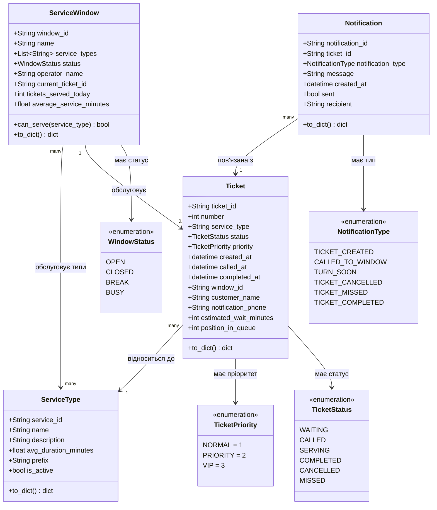

# Domain Model — Модель предметної області

## Бізнес-правила

- Талон може перейти: `WAITING → CALLED → SERVING → COMPLETED`
- Або: `WAITING/CALLED → CANCELLED`, `CALLED → MISSED`
- Вікно може обслуговувати лише типи послуг зі свого списку `service_types`
- Алгоритм черги (Strategy) визначає порядок видачі талонів
- При кожній зміні статусу талону — Observer надсилає Notification
- `estimated_wait_minutes = кількість_очікуючих × avg_duration_minutes`
