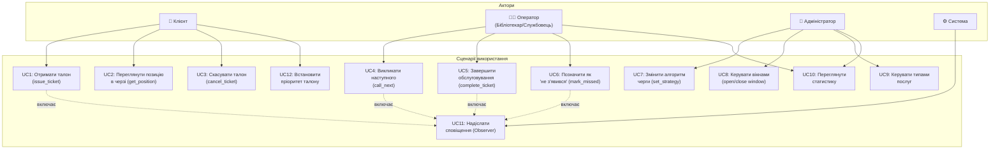

# Use Case Diagram — Система Електронної Черги

## Опис сценаріїв

| UC  | Назва | Актор | Передумова | Результат |
|-----|-------|-------|------------|-----------|
| UC1 | Отримати талон | Клієнт | Послуга активна | Талон зі статусом WAITING |
| UC2 | Переглянути позицію | Клієнт | Талон існує | Позиція та час очікування |
| UC3 | Скасувати талон | Клієнт | Талон не завершений | Статус CANCELLED |
| UC4 | Викликати наступного | Оператор | Черга не порожня | Статус CALLED + сповіщення |
| UC5 | Завершити обслуговування | Оператор | Статус CALLED/SERVING | Статус COMPLETED |
| UC6 | Позначити як пропущений | Оператор | Статус CALLED | Статус MISSED |
| UC7 | Змінити алгоритм | Адмін | — | FIFO / Priority / SJF |
| UC8 | Керувати вікнами | Адмін | — | Відкрити/закрити вікно |
| UC9 | Керувати послугами | Адмін | — | Додати/деактивувати послугу |
| UC10 | Переглянути статистику | Оператор/Адмін | — | Зведення по всіх статусах |
| UC11 | Надіслати сповіщення | Система | Подія в черзі | Notification у репозиторії |
| UC12 | Пріоритет талону | Клієнт | — | NORMAL / PRIORITY / VIP |
